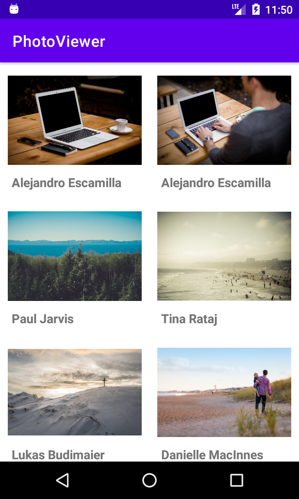
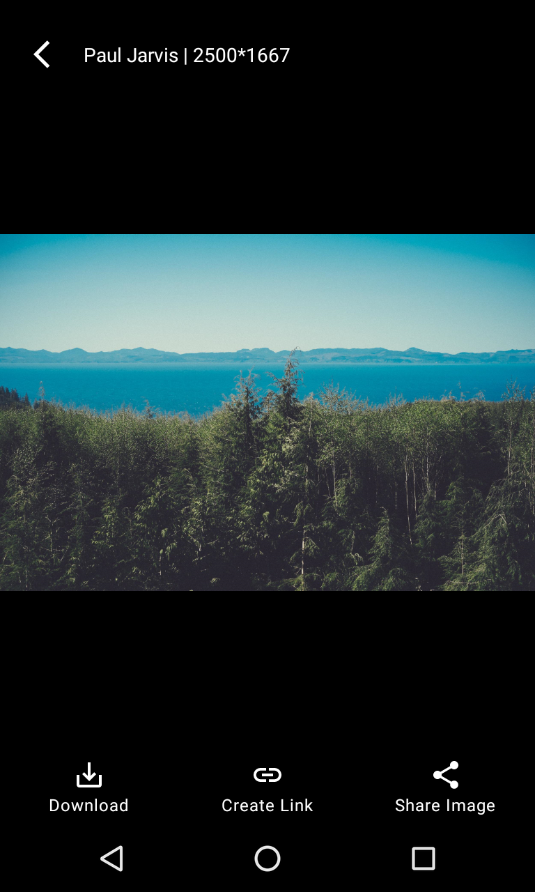
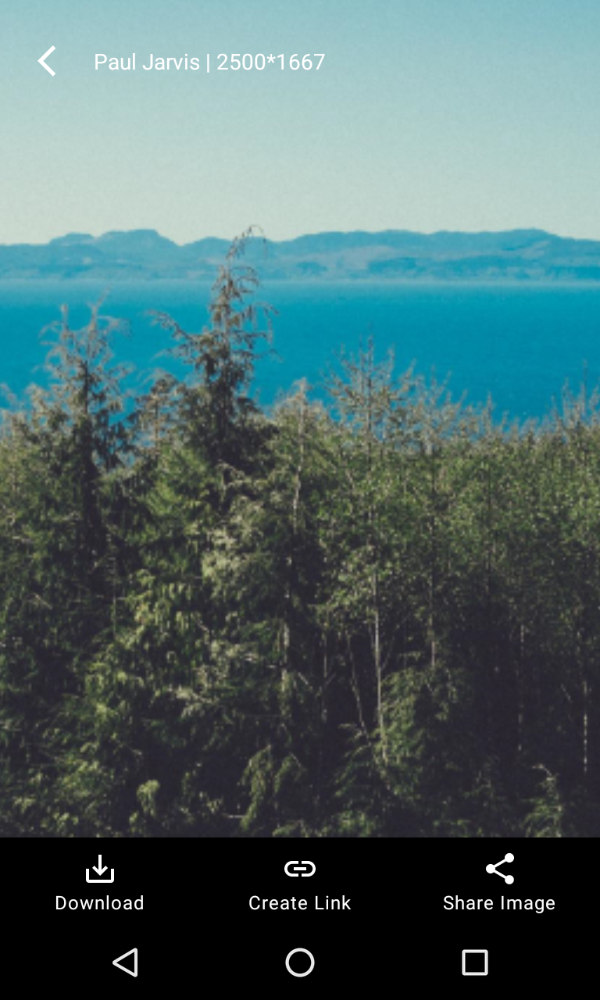
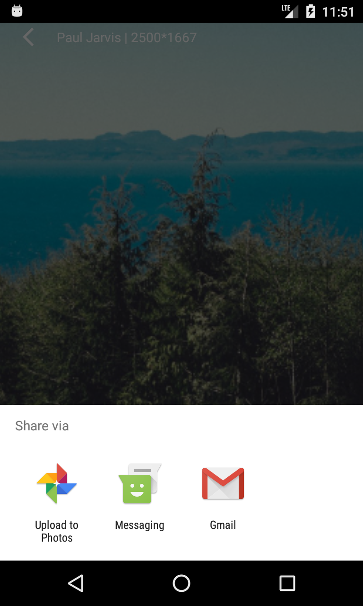
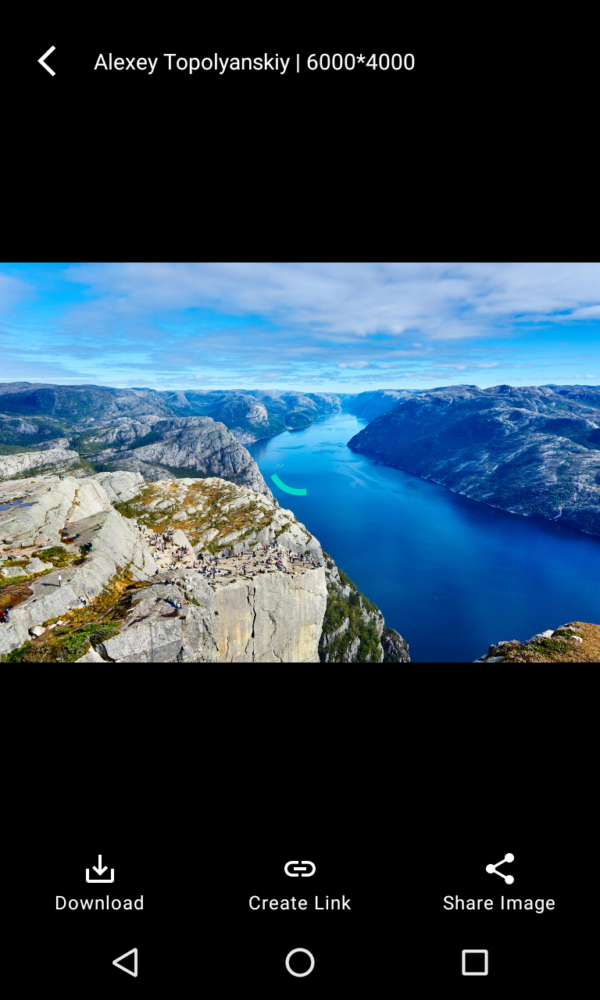

# Picsum-Image-Gallery
Browse list of photos and view it in full screen 
- view images in gallery
- view images in full screen
- zoom in/out images

# Technical Features
- on demand loading / infinity scroll
- cached images in disk space
- cached api response
- download image
- share image
- share link

# TODO
- unit test

# Screenshots
Landing View 

Full screen Image view 

 
Double tap to zoom 
 
Download/Share Image with progress 

---

